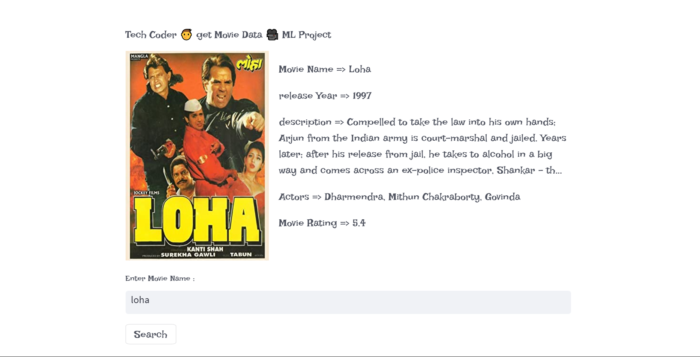
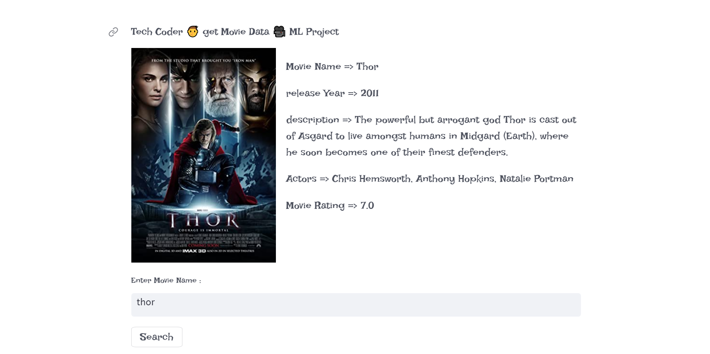

# get-Movie-Data

<h2 align="center"> Get Any Movie Data </h2>
 

</br>



  ## 💰 You can help me by Donating
  [](
  https://www.buymeacoffee.com/techcoder) 


 
 Before you begin, ensure you have met the following requirements:

* [Git](https://git-scm.com/downloads "Download Git") must be installed on your operating system.

### Run Locally

To run **Nike-Product-Ui** locally, run this command on your git bash:

Linux and macOS:

```bash
sudo git clone https://github.com/TechCdR/Nike-Product-Ui.git
```

Windows:

```bash
git clone https://github.com/TechCdR/Nike-Product-Ui.git
```

### Contact

If you want to contact with me you can reach me at [Instagram](https://www.instagram.com/techcoder__/).

### License
